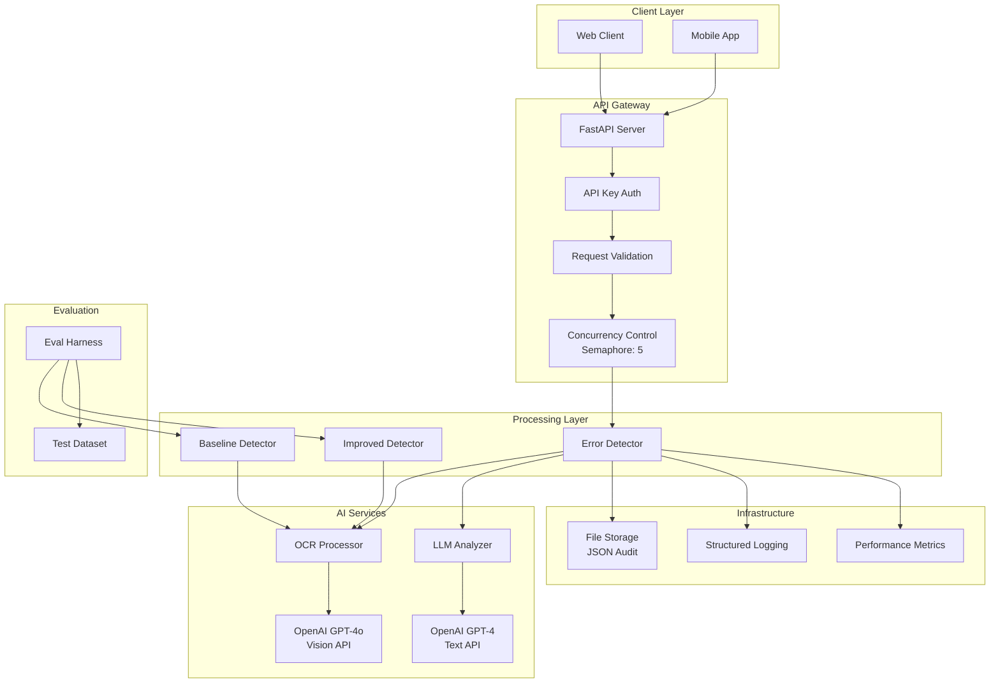

# System Architecture

## Overview
AI-powered error detection API for educational platforms using OCR + LLM pipeline with baseline/improved variants for ML evaluation.

## Architecture Diagram

## Components & Flow

### API Layer
- **FastAPI Gateway**: HTTP endpoints with CORS, validation, error handling
- **Authentication**: API key header validation
- **Concurrency Control**: Asyncio semaphore limiting 5 concurrent requests
- **Timeout Management**: 30s request timeout with graceful degradation

### Processing Pipeline
- **Error Detector**: Main orchestrator coordinating OCR → LLM → Response
- **OCR Processor**: OpenAI GPT-4o Vision API for mathematical text extraction
- **LLM Analyzer**: GPT-4 with structured prompts for error detection
- **Baseline vs Improved**: Two variants for ML evaluation and ablation

### Infrastructure
- **Storage**: File-based JSON persistence for request/response auditing
- **Logging**: Structured JSON logs with timestamps, job IDs, latencies
- **Metrics**: Performance tracking (latency percentiles, success rates)

## Request Lifecycle

1. **Ingress**: Client request → API gateway → auth validation
2. **Concurrency**: Semaphore acquisition (max 5 concurrent)
3. **Processing**: 
   - OCR text extraction from question/solution images
   - Diagram detection for context
   - LLM error analysis with structured prompts
4. **Response**: JSON response generation with error/correction/hint
5. **Persistence**: Request/response audit logging
6. **Observability**: Structured logging with performance metrics

## Scalability & Horizontal Scaling

### Stateless Design
- No session state or in-memory caching
- Each request is independent and self-contained
- Load balancer can distribute across multiple instances

### Scaling Plan
- **Horizontal**: Deploy multiple API instances behind load balancer
- **Vertical**: Increase concurrency limits and timeout thresholds
- **Caching**: Add Redis for response caching on repeated requests
- **Async Jobs**: Separate sync API from heavy OCR/LLM processing

### Bottlenecks & Mitigation
- **OpenAI Rate Limits**: Implement exponential backoff and circuit breakers
- **Image Processing**: Add image compression and format optimization
- **Storage I/O**: Migrate to database for better concurrent access

## Reliability & Security

### Failure Modes
1. **OpenAI API Failures**: Circuit breaker pattern, fallback responses
2. **Image URL Timeouts**: Retry logic with exponential backoff
3. **Memory/CPU Exhaustion**: Resource limits and health checks
4. **Storage Failures**: Graceful degradation, continue without persistence

### Security Measures
- **API Key Authentication**: Header-based auth with configurable keys
- **Input Validation**: Pydantic models for request/response validation
- **Rate Limiting**: Concurrency controls prevent resource exhaustion
- **PII Handling**: No sensitive data storage, signed URLs for images

### Idempotency
- Job IDs for request tracking and duplicate detection
- Deterministic responses for identical inputs
- Audit trail for debugging and compliance

## Performance & Cost Controls

### Token/Vision Budget
- **OCR**: ~500 tokens per image, $0.005 per request
- **LLM**: ~300 tokens per analysis, $0.02 per request
- **Total**: ~$0.03 per request, $3 per 100 requests

### Optimization Strategies
- **Image Downscaling**: Resize large images before API calls
- **Prompt Engineering**: Minimize token usage with structured prompts
- **Caching**: Store responses for repeated question/solution pairs
- **Batch Processing**: Group similar requests for efficiency

## Trade-offs & Alternatives Considered

### 1. OpenAI APIs vs Self-hosted Models
**Chosen**: OpenAI APIs
- **Pros**: High quality, no infrastructure, fast development
- **Cons**: Cost, rate limits, external dependency
- **Alternative**: Self-hosted LLaVA/CodeLlama for OCR + Llama for analysis

### 2. File Storage vs Database
**Chosen**: File-based JSON storage
- **Pros**: Simple setup, no external dependencies
- **Cons**: Poor concurrent access, no querying capabilities
- **Alternative**: PostgreSQL with JSON columns for structured storage

### 3. Synchronous vs Async Processing
**Chosen**: Hybrid (async I/O, sync processing)
- **Pros**: Simple error handling, predictable latency
- **Cons**: Blocks during LLM calls, limited throughput
- **Alternative**: Full async with job queues (Redis/Celery)

## Monitoring & Observability

- **Health Checks**: `/health` endpoint for load balancer probes
- **Structured Logs**: JSON format with job IDs, timestamps, latencies
- **Metrics**: Success rates, latency percentiles, error classifications
- **Alerting**: Monitor P95 latency > 10s, success rate < 95%